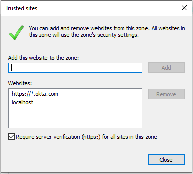

# Okta-Hosted Login Page Demo SPA

This demo basically shows how to use the [Okta React](https://github.com/okta/okta-oidc-js/tree/master/packages/okta-react) Library to login User to React application. 

The login is achieved through the [Authorization Code Flow with PKCE](https://developer.okta.com/docs/guides/implement-auth-code-pkce/overview/), where the User is redirected to the Okta-Hosted Login Page. 

After the User authenticates he or she is redirected back to the application with an ID token and access token.

This application is a front-end for [Spring Security OAuth2 Demo Applications for Okta](https://github.com/gennadyyonov/hello-okta).

This project was bootstrapped with [Create React App](https://github.com/facebook/create-react-app).

## Dependency Management

Dependencies are managed by [npm](https://docs.npmjs.com/)  
[Downloading and installing Node.js and npm](https://docs.npmjs.com/downloading-and-installing-node-js-and-npm)
```
node -v
v20.10.0

npm -v
10.2.3
```

### Available Scripts

* `npm start` - starts dev server at `http://localhost:3000` with HMR and all the magic to view it in the browser. 
* `npm run test` - runs Jest tests in interactive watch mode. More reading in the section [running tests](https://facebook.github.io/create-react-app/docs/running-tests).
* `npm run build` - builds the app for production to the `build` folder. See the section about [deployment](https://facebook.github.io/create-react-app/docs/deployment) for more information.
* [How to Update NPM Dependencies](https://www.freecodecamp.org/news/how-to-update-npm-dependencies/)

## Programming Language

* [TypeScript](https://www.typescriptlang.org/)
* [React+TypeScript Cheatsheets](https://github.com/typescript-cheatsheets/react-typescript-cheatsheet)

## JavaScript Libraries

* [React](https://reactjs.org/)
* [React Redux](https://react-redux.js.org/)
* [Okta React SDK](https://github.com/okta/okta-oidc-js/tree/master/packages/okta-react)
* [Okta Auth JavaScript SDK](https://github.com/okta/okta-auth-js)
* [React Router](https://reacttraining.com/react-router)
* [Redux Thunk](https://github.com/reduxjs/redux-thunk)
* [GraphQL Apollo Client](https://www.apollographql.com/docs/react/)
* [GraphQL Tag](https://github.com/apollographql/graphql-tag)
* [Material UI](https://material-ui.com/)

## Run Application on localhost

* Copy [`.env.development.sample`](.env.development.sample) to `.env.development`
* Fill in your configuration properties instead of `???`
    
    `BASE_URL` variable examples:
    * Localhost `BASE_URL=http://localhost:8060/`
    * K8s `BASE_URL=https://kubernetes.docker.internal/`
* Run `npm start`

## IE11 Compatibility

### Issue
[Okta Auth JavaScript SDK](https://github.com/okta/okta-auth-js) uses session and local storage to temporally save PKCE code verifier.

These storages are partitioned by security zones in the IE11 and older versions of Microsoft Edge browser.
When the application is redirected across zones, the session storage and local storage are cleared. 
Specifically, the session storage is cleared in the regular browser navigation, and both the session and local storage are cleared in the InPrivate mode of the browser.

Therefore, the following error can be received opening application in IE11 trying to get PKCE code verifier after it was cleared from storage upon navigation between application and Okta:
```
AuthSdkError: Could not load PKCE codeVerifier from storage. This may indicate the auth flow has already completed or multiple auth flows are executing concurrently.
```
### Workaround

Ensure that the application domain and any other sites involved in the redirects of the authentication flow are added as trusted sites in the security settings of the browser, so that they belong to the same security zone. 
To do so, follow these steps:

* Open **Internet Explorer** and click on the settings (gear icon) in the top-right corner
* Select **Internet Options**
* Select the **Security** tab
* Under the **Trusted Sites** option, click on the sites button and add the URLs in the dialog box that opens.



## Docker

```
docker-compose -f docker-compose-development.yml build web
docker-compose -f docker-compose-development.yml up web
```
**Note**, application should be built first using the following command:
```
npm install
npm run build
```
